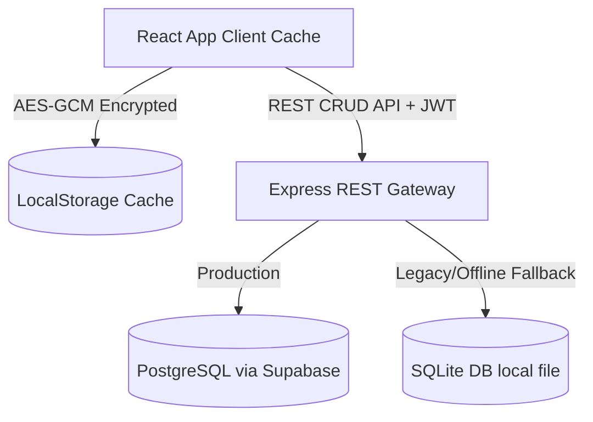

# AegisCert Security Architecture & Cryptographic Specifications

AegisCert is built on a Zero Trust architecture enforcing strict authentication, data integrity, secure storage at-rest, and cryptographic ledger verification.

---

## 🔐 Cryptographic Decisions

### 1. Password & MPIN Hashing (Server-Side)
- **Algorithm**: `bcrypt` (using `bcryptjs` for maximum portability).
- **Work Factor (Cost)**: `12` rounds.
- **Implementation**: Performed entirely server-side. High work-factor salts prevent offline GPU/brute-force cracking.
- **Usage**: Used for client credentials verification and secure 6-digit MPIN storage.

### 2. Database At-Rest Encryption (Client Cache)
- **Algorithm**: `AES-GCM` with a `256-bit` key size.
- **Key Derivation**: `PBKDF2` (Password-Based Key Derivation Function 2) using `100,000` iterations of `SHA-256`.
- **API**: Native browser **Web Crypto API** (`crypto.subtle`). Falls back gracefully to Node-compatible `globalThis.crypto` during unit testing.
- **Security Goal**: Protects local client cache databases (`dbCache` in local storage) against raw filesystem exposure and malware dumps.

### 3. Blockchain Ledger Integrity
- **Algorithm**: `SHA-256` (async SubtleCrypto).
- **consensus block mining**: PoW difficulty simulation matching blockchain nodes.
- **Randomness**: All transaction hashes and signatures utilize `crypto.getRandomValues` (secure random byte array generation) instead of unsafe `Math.random()`.

---

## 🗄️ Database & Persistence Design

- **Production Store**: PostgreSQL hosted on **Supabase** with Row-Level Security (RLS) enforcing strict tenant boundaries.
- **Development/Offline Fallbacks**: Local SQLite file database and `localStorage` cache mapping the dynamic delta updates via CRUD resource requests (`POST`, `PATCH`, `DELETE`).

---

## ⚡ Threat Modeling & Countermeasures

| Threat Vector | Mitigation Strategy | Implementation |
|---|---|---|
| **Brute Force Lockout** | Multi-failure limit | Accounts are locked out on the server for 15 minutes after 3 incorrect authentication attempts. |
| **Credential Hijacking** | Decoy honeytokens | Dekoy accounts (`backup_root`, `database_root`) trigger high-alert SOC events and AI fraud reports immediately upon access attempts. |
| **Data Leakage** | Plaintext localStorage | All cached local storage namespaces are AES-GCM encrypted. Keys can be rotated on-demand. |
| **Privilege Escalation** | JWT manipulation | Express endpoints utilize role-gated middleware validating JWT signatures signed with a secure server-side `JWT_SECRET`. |
| **Tenant Cross-Talk** | Multi-tenant isolation | Backend intercepts CRUD operations and isolates write boundaries by cross-checking `institutionId` resolved from the validated JWT token. |

---

## 🔧 Disaster Recovery & Key Rotation

### Key Rotation Procedure
1. Registrar navigates to the **Security Controls** panel or triggers `/rotate` via Command Nexus.
2. The browser generates a cryptographically secure 256-bit random key.
3. System decrypts local caches using the old PBKDF2 passphrase.
4. Records are re-encrypted under the new AES-GCM key and rewritten.
5. Obsolete cryptographic key parameters are immediately revoked and garbage collected.

### Password Recovery
1. User requests OTP. Backend generates a 6-digit verification code.
2. In production, this goes to an SMS gateway. In local development, the code is printed safely to the Node server console logs (removing client-side overlay intercepts).
3. The user inputs the code to authorize a forced password update.
